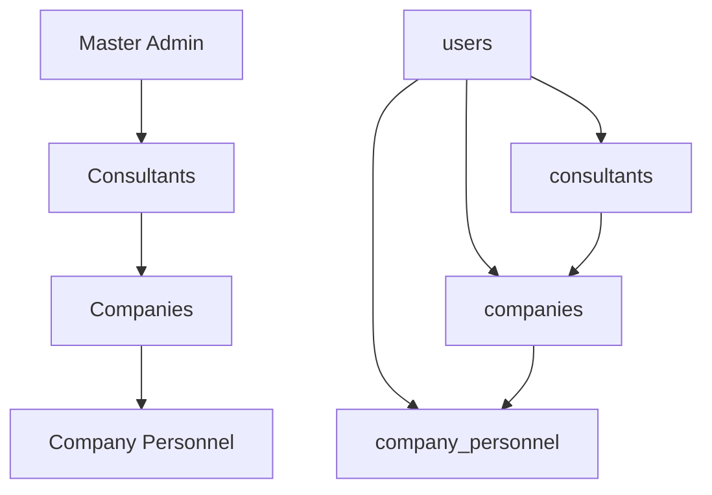

# 🏗️ PHASE 2.1: DATABASE SCHEMA DESIGN - IMPLEMENTATION GUIDE

## 📋 OVERVIEW

Bu guide, **multi-user hierarchy system** için database schema tasarımını ve implementation'ını detaylandırır.

## 🎯 OBJECTIVES

1. **Multi-level User Hierarchy:** Master Admin → Consultant → Company Owner → Personnel
2. **Backward Compatibility:** Existing code continues to work
3. **Scalable Architecture:** Support for future growth
4. **Data Integrity:** Constraints and business rules
5. **Performance Optimization:** Proper indexing and queries

## 📊 NEW DATABASE SCHEMA

### **Core Tables:**

| Table | Purpose | Key Features |
|-------|---------|--------------|
| `users` | Master user table | All users in one place, role-based |
| `companies` | Company management | Evolved from `firmalar` |
| `company_personnel` | Sub-users | Max 3 personnel per company |
| `consultants` | Admin sub-users | Manage assigned companies |
| `role_definitions` | Flexible roles | Permission system |
| `permissions` | Granular access | Fine-grained control |

### **Relationships:**



## 🚀 IMPLEMENTATION STEPS

### **Step 1: Database Schema Creation**

```bash
# Execute the schema creation
psql -h [SUPABASE_HOST] -U [USER] -d [DATABASE] -f database-schema-design.sql
```

### **Step 2: Data Migration**

```bash
# Execute the migration
psql -h [SUPABASE_HOST] -U [USER] -d [DATABASE] -f migration-plan.sql
```

### **Step 3: Verification**

```sql
-- Check migration success
SELECT * FROM migration_verification;

-- Check data integrity
SELECT * FROM data_integrity_check WHERE status != 'OK';
```

### **Step 4: Frontend Integration**

```typescript
// Import the new service
import { CompanyService, LegacyCompatibilityService } from '@/lib/user-hierarchy-service';

// For new code - use modern API
const companies = await CompanyService.getAllCompanies();

// For existing code - use compatibility layer
const firmalar = await LegacyCompatibilityService.getAllFirmalar();
```

## 🔄 MIGRATION STRATEGY

### **Phase 1: Parallel Operation**

- ✅ New schema exists alongside old `firmalar` table
- ✅ New features use new schema
- ✅ Old features use compatibility functions
- ✅ Zero downtime migration

### **Phase 2: Gradual Cutover**

- 🔄 Update services one by one to use new schema
- 🔄 Maintain data sync between old and new
- 🔄 Test thoroughly

### **Phase 3: Complete Migration**

- 🎯 All code uses new schema
- 🎯 Archive old tables
- 🎯 Remove compatibility layer

## 📈 BENEFITS

### **Immediate Benefits:**

1. **Multi-User Support:** Companies can add up to 3 personnel
2. **Consultant System:** Admin can assign consultants to companies
3. **Role-Based Access:** Granular permission system
4. **Better Organization:** Clear user hierarchy
5. **Audit Trail:** Activity logging built-in

### **Future Benefits:**

1. **Scalability:** Easy to add new roles/permissions
2. **Compliance:** Comprehensive audit trail
3. **Performance:** Optimized with proper indexes
4. **Flexibility:** JSONB fields for extensibility
5. **Security:** Session management and access control

## 🛡️ SECURITY FEATURES

### **Built-in Security:**

- ✅ **Role-based Access Control (RBAC)**
- ✅ **Session Management**
- ✅ **Activity Logging**
- ✅ **Data Constraints**
- ✅ **Business Rule Enforcement**

### **Security Best Practices:**

- 🔒 **Password Hashing** (to be implemented with Supabase Auth)
- 🔒 **JWT Token Management**
- 🔒 **Rate Limiting** (application level)
- 🔒 **Input Validation**
- 🔒 **SQL Injection Prevention**

## 📋 VALIDATION CHECKLIST

### **Pre-Migration Checklist:**

- [ ] Backup existing database
- [ ] Test schema on staging environment
- [ ] Validate migration scripts
- [ ] Prepare rollback plan
- [ ] Review security permissions

### **Post-Migration Checklist:**

- [ ] Verify data integrity
- [ ] Test all user types login
- [ ] Validate company creation
- [ ] Test personnel addition
- [ ] Check consultant assignment
- [ ] Verify backward compatibility

### **Performance Checklist:**

- [ ] Analyze query performance
- [ ] Check index usage
- [ ] Monitor database size
- [ ] Validate constraint performance
- [ ] Test concurrent access

## 🚨 ROLLBACK PLAN

### **If Migration Fails:**

```sql
-- Emergency rollback
SELECT rollback_migration();

-- Restore from backup
-- Restart application
```

### **Rollback Conditions:**

- Data corruption detected
- Performance degradation
- Business logic errors
- Security vulnerabilities
- Application instability

## 📞 SUPPORT & TROUBLESHOOTING

### **Common Issues:**

1. **Migration Timeout:** Increase statement timeout
2. **Data Mismatch:** Check email formatting
3. **Permission Errors:** Verify Supabase role permissions
4. **Performance Issues:** Check index creation
5. **Constraint Violations:** Review data quality

### **Debug Queries:**

```sql
-- Check user distribution
SELECT role_type, COUNT(*) FROM users GROUP BY role_type;

-- Check company ownership
SELECT COUNT(*) as companies_without_owner 
FROM companies c 
LEFT JOIN users u ON u.id = c.owner_user_id 
WHERE u.id IS NULL;

-- Check personnel limits
SELECT c.company_name, c.max_personnel, COUNT(cp.id) as current_personnel
FROM companies c
LEFT JOIN company_personnel cp ON cp.company_id = c.id AND cp.status = 'active'
GROUP BY c.id, c.company_name, c.max_personnel
HAVING COUNT(cp.id) > c.max_personnel;
```

## 🎯 NEXT STEPS

### **Phase 2.2: Multi-level Authentication System**

- Implement new authentication flow
- Update login components
- Add role-based routing
- Implement session management

### **Phase 2.3: Firma Sub-user System**

- Build personnel management UI
- Implement invitation system
- Add permission management
- Create user onboarding flow

### **Phase 2.4: Admin Consultant Management**

- Build consultant dashboard
- Implement company assignment
- Add workload management
- Create consultant analytics

---

**✅ PHASE 2.1 COMPLETION CRITERIA:**

- [ ] New database schema created and tested
- [ ] Data migration completed successfully
- [ ] Backward compatibility verified
- [ ] Performance benchmarks met
- [ ] Security requirements satisfied
- [ ] Documentation completed
- [ ] Team trained on new system

**🎉 SUCCESS METRICS:**

- Zero data loss during migration
- No downtime for end users
- Improved query performance
- Enhanced security posture
- Foundation for multi-user features
